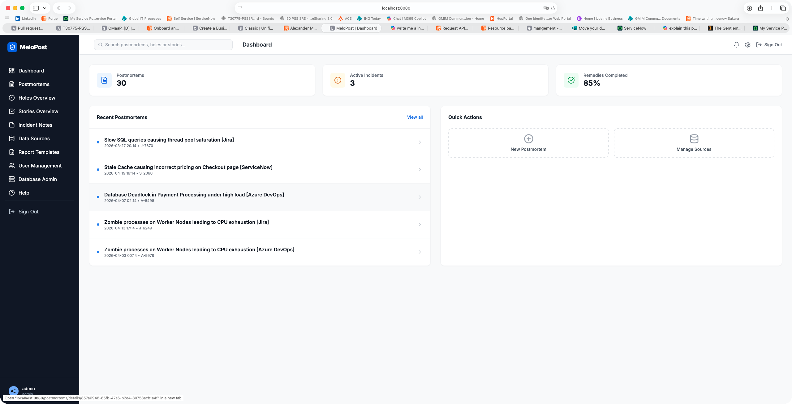

# Melopost User Guide

Welcome to the comprehensive Melopost User Guide. Melopost is a specialized platform designed for systematic incident postmortems and root cause analysis using the **Swiss Cheese Model**. Our goal is to move beyond simple blame and identify the systemic weaknesses that allow incidents to occur.

---

## Table of Contents
1. [Introduction](#1-introduction)
2. [Getting Started](#2-getting-started)
3. [Dashboard & Overview](#3-dashboard--overview)
4. [Managing Postmortems](#4-managing-postmortems)
    - [Creating a Postmortem](#creating-a-postmortem)
    - [Impact Section & Documents](#impact-section--documents)
    - [Incident Notes](#incident-notes)
5. [Swiss Cheese Analysis](#5-swiss-cheese-analysis)
    - [Defense Layers](#defense-layers)
    - [Identifying Holes](#identifying-holes)
    - [Hole Overview](#hole-overview)
6. [Remedial Actions (Stories)](#6-remedial-actions-stories)
7. [Reporting](#7-reporting)
8. [Administration](#8-administration)
    - [User Management](#user-management)
    - [Data Sources](#data-sources)
    - [Report Templates](#report-templates)
    - [Database Administration Tool](#database-administration-tool)
9. [API & Database Documentation](#9-api--database-documentation)

---

## 1. Introduction

MeloPost helps teams perform deep-dive analysis into why things went wrong. By visualizing defenses as slices of Swiss cheese, we can identify where the "holes" (weaknesses) aligned to create a path for an incident.

---

## 2. Getting Started

### Access & Login
Navigate to your Melopost instance (e.g., `http://localhost:8080`).

- **Default Credentials**: `admin` / `admin` (Please change these upon first login).
- Enter your credentials to access the central dashboard.

---

## 3. Dashboard & Overview

The Dashboard is your command center, providing high-level metrics and quick access to recent work.

- **Metrics**: Track total postmortems, active analysis, and remedial action progress.
- **Search**: Quickly find postmortems by title, reference, or tags.
- **Recent Activity**: View the latest incidents being analyzed.

---

## 4. Managing Postmortems

### View All Postmortems
The "All Postmortems" view provides a filterable list of every incident in the system.

- **Filtering**: Filter by Status (In Analysis, Actioned, Published), Type, or Department.
- **Quick Status**: See the number of identified holes and remedial stories at a glance.

### Creating a Postmortem
Click **"Create New Postmortem"** to start the analysis process.

Fill in the essential details:
- **Title & Reference**: Clear name and incident tracking number (e.g., INC-1234).
- **Type & Status**: Define the severity and current phase of analysis.
- **Incident Dates**: Capture when the incident started and when it was resolved.

### Impact Section & Documents
A thorough postmortem requires documenting the full impact and gathering evidence.

- **Impact Description**: Detailed narrative of the incident's effect on customers and systems.
- **Document Attachments**: Upload logs, screenshots, or chat transcripts directly to the postmortem record.

### Postmortem Notes
Melopost includes a dedicated "Incident Notes" feature (replacing legacy Loop systems) for raw data collection.

- **Rich Text Editing**: Use the integrated Froala Editor V5 for professional documentation.
- **Note Management**: View and filter all incident notes across the platform.

---

## 5. Swiss Cheese Analysis

This is the core of Melopost. We use 10 standard defense layers to map the incident.

### Defense Layers
Every postmortem automatically includes layers such as **Define, Design, Build, Test, Release, Run, Resilience, Observability, Incident Handling, and Human**.

### Identifying Holes
For each layer, you identify "Holes" – specific weaknesses that allowed the incident to progress.

### Hole Overview
The **Hole Overview** provides a centralized view of all identified weaknesses across all postmortems. This is crucial for identifying recurring systemic issues that may affect multiple services or departments.

- **Filtering**: Search for holes by keyword, team, layer, or status.
- **Aggregated View**: See the status of all "plugs" (remedial actions) in one place.

---

## 6. Remedial Actions (Stories)

Holes must be plugged. In Melopost, we create **Stories** to track these remedial actions.

- **External Integration**: Link stories directly to **Jira**, **ServiceNow**, or **Azure DevOps**.
- **Assignment**: Assign responsibility to specific departments.
- **Tracking**: Monitor the status of every remedy to ensure the hole is truly closed.

---
### Incident Notes

---

## 7. Reporting

Generate professional PDF reports to share with stakeholders and leadership.

- **Mustache Templates**: Create and manage customizable reporting templates.
- **One-Click Export**: Generate a full postmortem report including timeline, impact, analysis, and actions.

---

## 8. Administration

### User Management
Control access to the platform and assign roles.

### Data Sources
Configure integrations with external ticket systems.

### Database Administration Tool
For administrators, Melopost includes a built-in database management tool to inspect the underlying data directly.

- **SQL Console**: Run CQL (Cassandra Query Language) queries directly against the database.
- **Schema Browser**: Browse all tables and User Defined Types (UDTs).
- **Data Export**: Export query results to CSV for external analysis.

---

## 9. API & Database Documentation

For advanced users and developers, Melopost provides built-in documentation for its internal workings.

### API Documentation
Explore available endpoints for automation and integration.

### Database Schema
View the underlying Cassandra data model and UDTs (User Defined Types).

